# 你不知道的Chrome调试技巧

## 前言

### Chrome介绍

Chrome 是一款由 Google 公司开发的网页浏览器，该浏览器基于其他开源软件撰写，包括 WebKit，目标是提升稳定性、速度和安全性，并创造出简单且有效率的使用者界面。

对于大部分人来说，Chrome 可能只是个浏览器，但是对于开发人员来说，它更是一个强大无比的工具，为了方便开发人员调试代码，主流的浏览器都内置了 DevTools，所以无论你是前端还是后端，掌握 Chrome 的调试技巧意味着效率直接的提高。

### 关于DevTools

Chrome 开发者工具是一套内置于Google Chrome中的Web开发和调试工具，可用来对网站进行迭代、调试和分析。

#### 打开Chrome开发者工具

* 在 Chrome 菜单中选择 *更多工具* > *开发者工具*
* 在页面元素上点击右键，选择 *检查*
* 使用快捷键 Ctrl + Shift + I (Windows) 或 Cmd + Opt + I (Mac)

### 了解面板

#### 1. 元素面板

使用元素面板可以自由的操作 DOM 和 CSS 来迭代布局和设计页面。

* 检查和调整页面
* 编辑样式
* 编辑 DOM

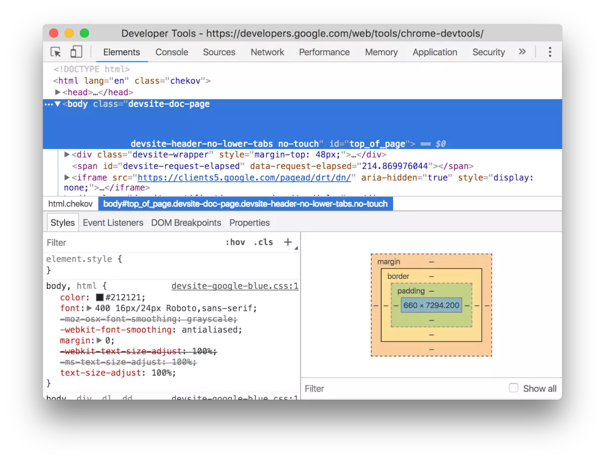

#### 2. 控制台面板

在开发期间，可以使用控制台面板记录诊断信息，或者使用它作为 shell 在页面上与 JavaScript 交互。

* 使用控制台面板
* 命令行交互

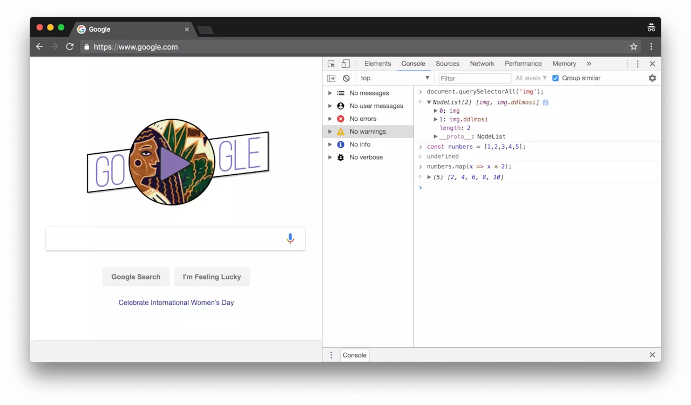

#### 3. 源代码面板

在源代码面板中设置断点来调试 JavaScript ，或者通过 Workspaces（工作区）连接本地文件来使用开发者工具的实时编辑器

* 断点调试
* 调试混淆的代码
* 使用开发者工具的 Workspaces（工作区）进行持久化保存

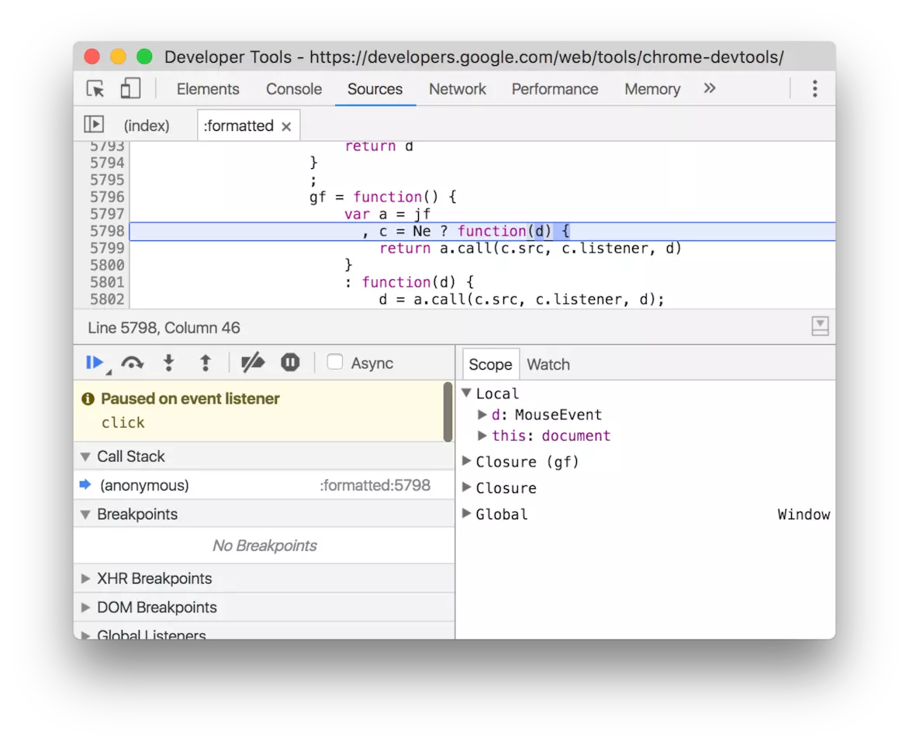

#### 4. 网络面板

使用网络面板了解请求和下载的资源文件并优化网页加载性能。

* 网络面板基础
* 了解资源时间轴
* 网络带宽限制

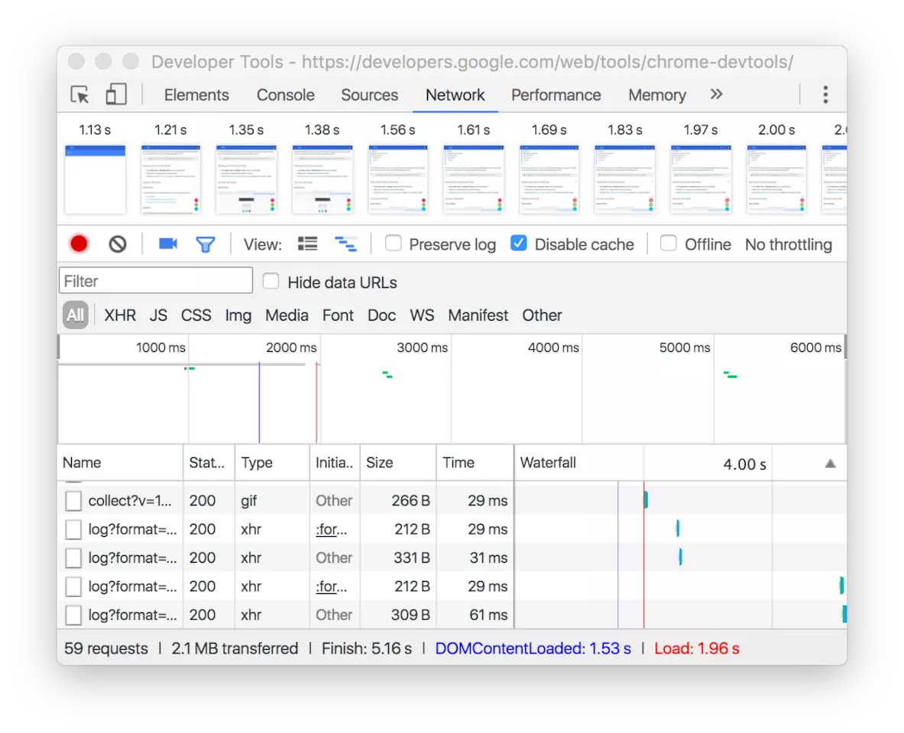

#### 5. 性能面板

使用时间轴面板可以通过记录和查看网站生命周期内发生的各种事件来提高页面的运行时性能。


#### 6. 内存面板

如果需要比时间轴面板提供的更多信息，可以使用“配置”面板，例如跟踪内存泄漏。

* JavaScript CPU 分析器
* 内存堆区分析器

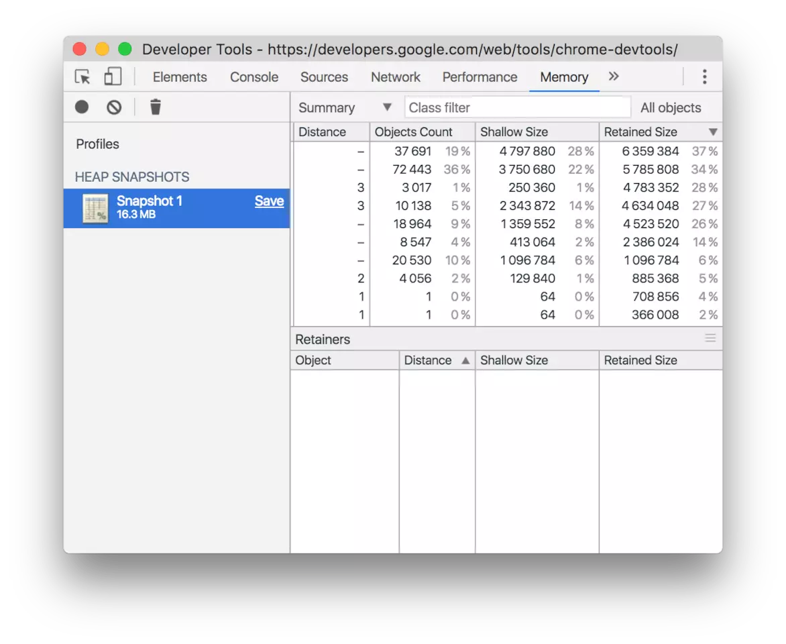

#### 7. 应用面板

使用资源面板检查加载的所有资源，包括 IndexedDB 与 Web SQL 数据库，本地和会话存储，cookie ，应用程序缓存，图像，字体和样式表。

* 管理数据


#### 8. 安全面板

使用安全面板调试混合内容问题，证书问题等等。

* 安全


## 通用篇 

### copying & saving

在调试的过程中，我们总要对 Dev Tools 里面的数据进行 复制 或者 保存 的操作，所以我们来看看，关于这些，有什么小技巧呢？

#### 1. copy(...)

你可以通过全局的方法 copy() 在 console 里 copy 任何你能拿到的资源。例如 copy($_) 或 copy($0)


#### 2. Store as global (存储为一个全局变量)

如果你在 console 中打印了一堆数据 (例如你在 App 中计算出来的一个数组) ，然后你想对这些数据做一些额外的操作比如我们刚刚说的 copy (在不影响它原来值的情况下) 。 那就可以将它转换成一个全局变量，只需要 右击 它，并选择 “Store as global variable” (保存为全局变量) 选项。

第一次使用的话，它会创建一个名为 temp1 的变量，第二次创建 temp2，第三次 ... 。通过使用这些变量来操作对应的数据，不用再担心影响到他们原来的值:


#### 3. 保存堆栈信息( Stack trace )

大多数情况下都不是一个人开发一个项目，而是一个团队协作，那么如何准确的描述问题，就成为了沟通的关键 ，这时候 console 打印出来的堆栈跟踪的信息对你和同事来说就起大作用了，可以省去很多沟通成本，所以你可以直接把堆栈跟踪的信息保存为一个文件，而不只是截图发给对方：


#### 4. 直接Copy HTML

几乎所有人都知道，右击或者点击在 HTML 元素边上的省略号 (...) 就可以将它 copy 到剪贴板中，但是你不知道的是：古老的[ctrl] + [c]大法依旧可用！


### 快捷键和通用技巧

能直接快速提升开发效率的方式是什么？

* 掌握快捷键

这里是一些我们在日常前端开发中，相当实用的快捷键：

#### 1. 切换 DevTools 窗口的展示布局

可以通过 DevTools 的下拉菜单，或者命令菜单...或者使用一个快捷键 ctrl + shift + D (⌘ + shift + D Mac) 来实现位置的切换（通常是从 开始的位置 到 右边位置， 但是如果一开始就是 右边的位置 那么会切换到 左边的位置）:


#### 2. 切换 DevTools 的面板

如果可以的话，我想成为一个不需要鼠标的开发者，日常开发中，我们常需要从 元素面板 跳转到 资源面板 并返回，这样往返的来调试我们的代码，怎么来节省鼠标点击的时间呢：

* 按下 ctrl + [ 和 ctrl + ] 可以从当前面板的分别向左和向右切换面板。

* 按下 ctrl + 1 到 ctrl + 9 可以直接转到编号 1...9 的面板( ctrl + 1 转到元素面板，ctrl + 4 转到 网络信息面板等等)

请注意! 我们在上面介绍的第二组快捷键默认被禁用了。你可以通过 *DevTools* > *Settings* > *Preferences* > *Appearance* 来打开这个选项：


#### 3. elements， logs， sources & network 中的查找

DevTools 中的前4个主要的面板，每一个都支持 [ctrl] + [f] 快捷方式，你可以使用对应的查询方式来查找信息:

* 在 Elements 面板中 - 通过 string ，选择器 或者 XPath 来查找

* 而在 Console， Network 以及 Source 面板 - 通过区分大小写，或者可以被视为表达式的 strings， 来查找


#### 4. 其他常用快捷键

**ctrl+p** 项目中定位文件

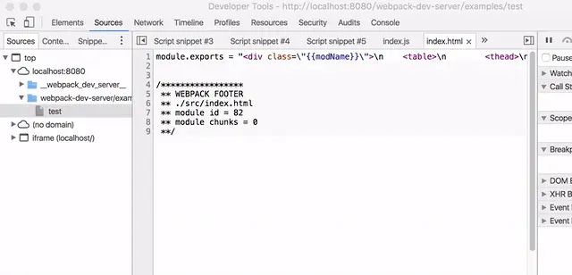

**ctrl+shif+o** 文件中定位成员函数


**ctrl + p** 源代码快速定位到某一行！


**Alt + Click** 展开所有节点


### 使用 Command

Command 菜单可以帮助我们快速找到那些被隐藏起来的功能，这也是它本身必不可少的原因。

* 在 Chrome 的调试打开的情况下 按下 [ Ctrl] + [Shift] + [P] (Mac： [⌘] + [Shift]+ [P] )

* 或者使用 DevTools 的 dropdown 按钮下的这个选项:


#### 1. 截屏的新姿势

当你只想对一个特别的 DOM 节点进行截图时，你可能需要使用其他工具弄半天，但现在你直接选中那个节点，打开 Command 菜单并且使用 节点截图 的就可以了。

不只是这样，你同样可以用这种方式 全屏截图 - 通过 Capture full size screenshot 命令。请注意，这里说的是全屏，并不是嵌入页面的一部分。一般来说这可是得使用浏览器插件才能做到的事情！


#### 2. 快速切换面板

DevTools 使用双面板布局，形式一般是：元素面板 + 资源面板 ，它根据屏幕可用的部分，经常将不同面板横向或者纵向的排列，以适合阅读的方式展示出来。但有时候我们并不喜欢默认的布局。

打开 Commands 菜单并且输入 layout ，你会看到 2 到 3 个可供选择的项(这里不再显示你已经激活的选项)：

* 使用横向面板布局
* 使用纵向面板布局
* 使用自动面板布局


#### 3. 快速切换主题

在 Commands 菜单中寻找与 theme 相关的选项，实现 明亮 & 暗黑 两种主题之间的切换：


#### 4. 代码折叠

在 Commands 菜单中寻找与 folding 相关的选项，打开折叠功能


### 代码块的使用

记住一段脚本会很麻烦，那怎么解决这个问题呢？

这就是 Snippets 的用武之地：它允许你存放 JavaScript 代码到 DevTools 中，方便你复用这些 JavaScript 代码块：

进入到 Sources 面板，在导航栏里选中 Snippets 这栏，点击 New snippet(新建一个代码块) ，然后输入你的代码之后保存，现在你可以通过右击菜单或者快捷键： [ctrl] + [enter] 来运行它了：

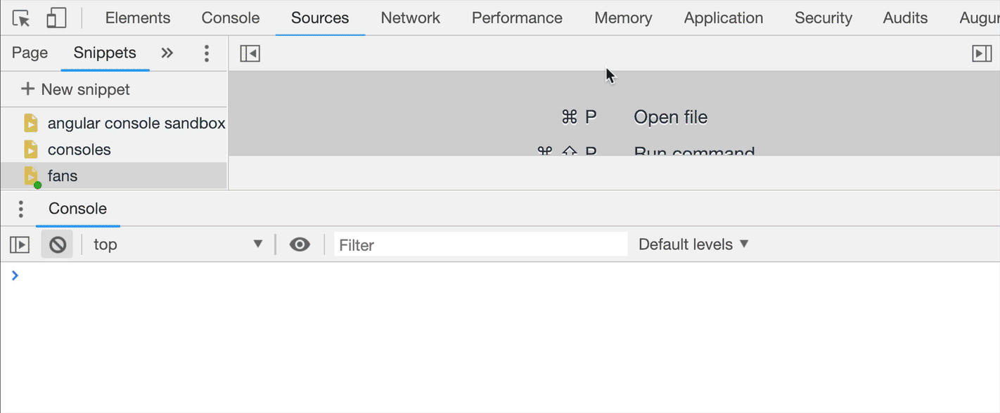

当你在 DevTools 中预设了一组很棒的代码块以后，甚至都不必再通过 Sources 来运行它们。使用 Command Menu 才是最快的方式。只需在它的输入框中输入 ! ，就可以根据名字来筛选预设代码块：


## console 篇 

### console 中的 '$'

$ 作为 jQuery 的选择器，承载了一代前端的太多记忆，但是你可能没有想到的是，在我们使用 Dev Tools 进行调试的时候，$ 也有大放异彩的一天呢？

#### 1. $0

在 Chrome 的 Elements 面板中， $0 是对我们当前选中的 html 节点的引用。

理所当然，$1 是对上一次我们选择的节点的引用，$2 是对在那之前选择的节点的引用，等等。一直到 $4

你可以尝试一些相关操作(例如: $1.appendChild($0))


#### 2. $ 和 $$

如果你没有在 App 中定义过 $ 变量 (例如 jQuery )的话，它在 console 中就是对这一大串函数 document.querySelector 的别名。

如果是 $$ 就更加厉害了，还能节省更多的时间，因为它不仅执行 document.querySelectorAll 并且它返回的是：一个节点的 数组 ，而不是一个 Node list

本质上来说 Array.from(document.querySelectorAll('div')) === $$('div') ，但是document.querySelectorAll('div') 和 $$('div') 哪一种方式更加优雅呢？

#### 3. $_

调试的过程中，你经常会通过打印查看一些变量的值，但如果你想看一下上次执行的结果呢？再输一遍表达式吗？

这时候 $_ 就派上了用场，$_ 是对上次执行的结果的 引用 ：


#### 4. $i

现在的前端开发过程，离不开各种 npm 插件，但你可能没有想过，有一天我们竟然可以在 Dev Tools 里面来使用 npm 插件！

有时你只是想玩玩新出的 npm 包，现在不用再大费周章去建一个项目测试了，只需要在 Chrome插件: **Console Importer** 的帮助之下，快速的在 console 中引入和测试一些 npm 库。

运行 $i('jquery') 几秒钟后，你就可以获取到 jquery 了:

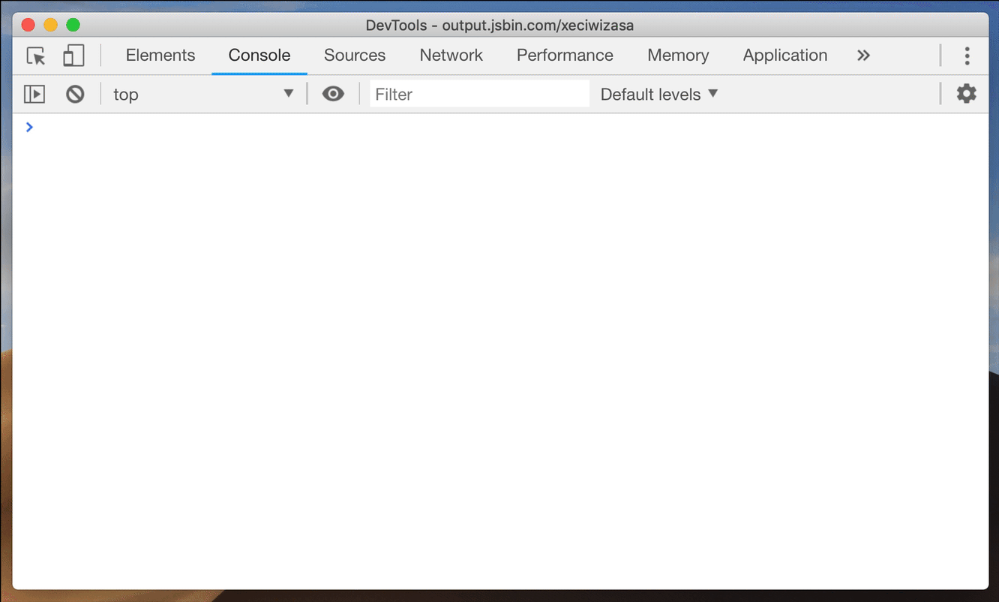

### console中骚操作

最开始接触前端的时候，学会用的就是 console.log ，甚至现在，大部分情况也还在用它调试，但是，在不同的场景下，除了 log ，其实有更好的选择。

#### 1. console.assert

当我们传入的第一个参数为 假 时，console.assert 打印跟在这个参数后面的值。


#### 2. 增强 log 的阅读体验

有时即使你 console.log 一个简单的变量，你可能会忘记（或混淆）哪一个是那个。那当你有不同的变量需要打印的时候，阅读起来会更费劲。

假如有这么一堆你想要输出但看起来并不易读的数据


为了让它变得更加易读，你可以打印一个对象 - 只需将所有 console.log 的参数包装在大括号中。感谢 ECMAScript 2015 中引入了 enhanced object literal(增强对象文字面量) ，所以加上 {} 已经是你需要做的全部事情了：


#### 3. console.table

console.table 这个小技巧在开发者中可能并没有多少人知道: 如果有一个 数组 (或者是 类数组 的对象，或者就是一个 对象 )需要打印，你可以使用 console.table 方法将它以一个漂亮的表格的形式打印出来。它不仅会根据数组中包含的对象的所有属性，去计算出表中的列名，而且这些列都是可以 缩放 甚至 还可以排序!!!

如果你觉得展示的列太多了，使用第二个参数，传入你想要展示的列的名字:

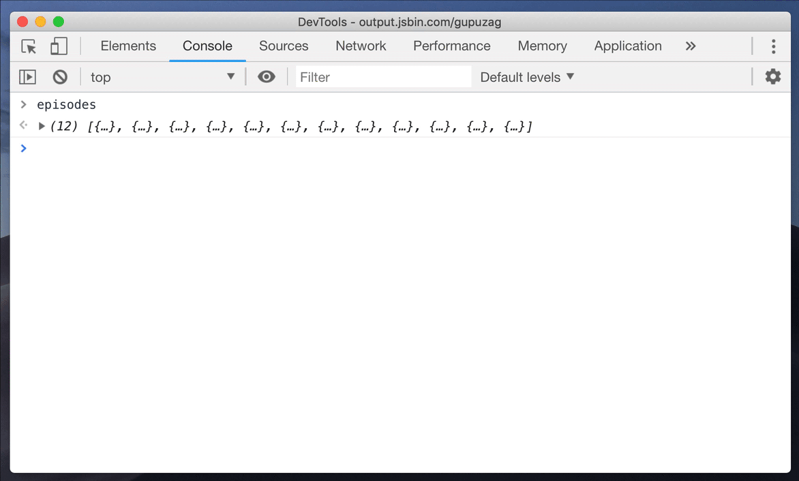

#### 4. table 和 {} 的配合

我们刚刚看到了 console.table 这个技巧，也了解了在他上面的 {} ，那么我们为什么不将他们结合起来打造一个终极 log 呢？

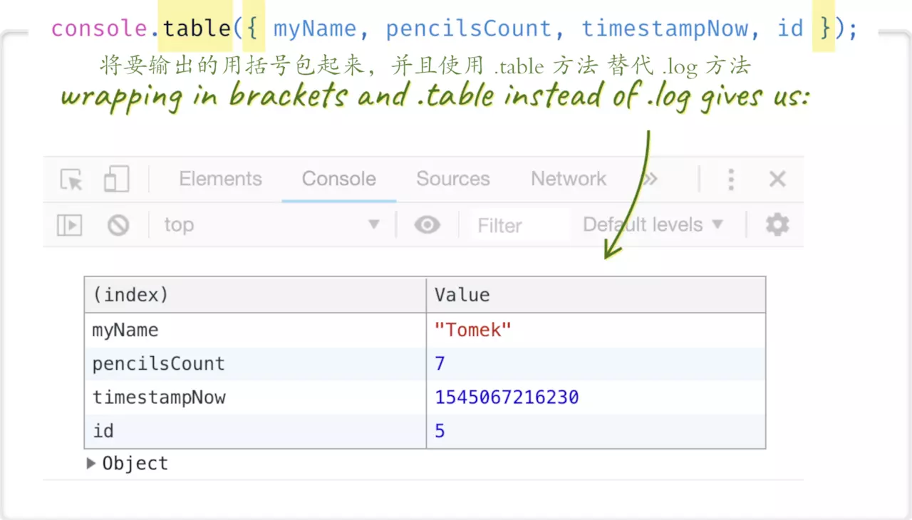

#### 5. console.dir

有时候你想要打印一个 DOM 节点。 console.log 会将这个交互式的元素渲染成像是从 Elements 中剪切出来的一样。如果说你想要查看 这个节点所关联到的真实的js对象 呢？并且想要查看他的 属性 等等？

在那样的情况下，就可以使用console.dir:


#### 6. 给 logs 加上时间戳

我们总是需要打印各式各样的信息，之前我们讨论了如何让输出的信息更加直观，但是如果我们需要打印相关的时间信息呢？这就用到了计时的相关操作。

如果你想要给你的应用中发生的事件加上一个确切的时间记录，开启 timestamps 。你可以在设置(在调试工具中的 ⋮ 下拉中找到它，或者按下 F1 )中来开启或者使用 Commands Menu：


#### 7. 给你的 console.log 加上 CSS 样式

如果你给打印文本加上 %c 那么 console.log 的第二个参数就变成了CSS 规则！这个特性可以让你的日志脱颖而出(例如 Facebook 在你打开 console 的时候所做的一样)


#### 8. 使用实时表达式

在本文形成的不久前，DevTools 在 Console 面板中引入了一个非常漂亮的附加功能，这是一个名为 Live expression 的工具

只需按下 "眼睛" 符号，你就可以在那里定义任何 JavaScript 表达式。 它会不断更新，所以表达的结果将永远存在 

同时支持定义好几个：


```
document.scrollingElement.scrollTop
```

## Network 篇 

Network 作为我们经常调试的 Chrome 面板，你知道它有哪些使用技巧吗？

### 1. 隐藏 network overview

你经常查看 Network 面板是为了:

* 我想看看请求的时间轴信息
* 我就想看看请求列表- 确认下请求状态，资源大小和响应结果呢

我赌你是后者，如果是这样，那么 Overview 的部分就没有任何理由占用 Network 接近一半的空间。隐藏它！


### 2. 请求过滤

Network 面板中的过滤器输入框接受字符串或正则表达式，对应显示匹配的请求。 但是你也可以使用它来过滤很多属性。

只需输入 例如 method 或者 mime-type :

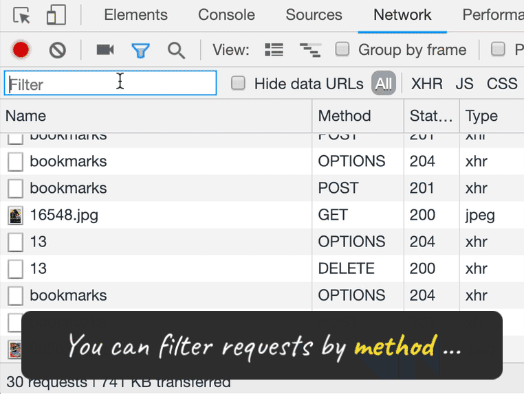

如果想要显示所有可能的关键字，在空白的输入框按下 [ctrl] + [space]

### 3. 自定义请求表

要自定义显示哪些列，右键单击请求表标题上的任意位置。


### 4. 重新发送 XHR 的请求

如何重新发送 XHR 的请求？刷新页面？太老套了，试试这么做：


### 5. XHR/fetch 断点

在某一特定时刻，你想要对已发送的 “ajax” 请求进行捕获怎么做呢？ 可以使用 XHR/fetch breakpoint 。

你可以添加部分 URL 作为触发器或监听任何请求：


## Drawer 篇 

说到 Drawer 大部分的朋友可能都很陌生，那 Drawer 是个什么东西？ Chrome DevTools 有很多部分，被分为9个 tab (俗称选项卡) ( Elements ， Console ， Sources ， Network ， 等等...)

但是，那仅仅是它的一部分而已！有一组平行的选项卡，被隐藏在主窗口之下。这个组合被称为 Drawer

### 1. 如何打开 Drawer ?

当你在 DevTools（任何选项卡）中时，按 [esc] 来显示它，再次按 [esc] 隐藏它：


默认情况下，您会看到一个 console 选项卡。 与主面板的 console 完全相同。 这就是为什么主面板会显示除了 console 之外的每个主要标签（ Elements ，Sources ，Network ...）- 因为在主面板中显示 console 没有意义。

这样的 console 很方便，例如在 Elements 选项卡打开时，我们同时可以看到 console 面板。但是在 Drawer 中其实还隐藏了更多细节。

### 2. Drawer 里面到底有什么？

Drawer 里隐藏着许多其他功能，大多数时候你可能不需要用到它们，这也是它们为什么被隐藏起来的原因，然鹅，你可以直接选择你想展示在这里的功能。

点击主页面在 Drawer的 console 面板前面的 ⋮ 图标来打开完整选项列表。另外，你也可以打开之前我们提到的 command Menu ，然后输入 Drawer 来打开


### 3. 控制传感器

如果你正在你的应用中使用一些获取位置信息的 API 而且想要测试一下它，总不能开着车环绕世界吧，(其实也不是不行😉)。

Drawer 里的 Sensors(传感器) 面板可以让你模拟特定的位置: 支持从预定义的位置中进行选择，添加自己的位置，或者手动键入纬度/经度。选定的值将被 navigator.geolocation.watchPosition（或 .getCurrentPosition ）报告。

如果你的 App 使用加速计，传感器面板也可以模拟你设备在3D空间中的位置！


### 4. Animations

打开这个组件，触发页面动画后会出现如图上。可以控制动画速度，拦截动画播放，手动拉动动画进行慢速播放。


### 5. Change

这个工具可以看到页面加载以来所有你的临时手动修改


## End

**推荐：** 

https://umaar.com/dev-tips/

https://www.html.cn/doc/chrome-devtools/


